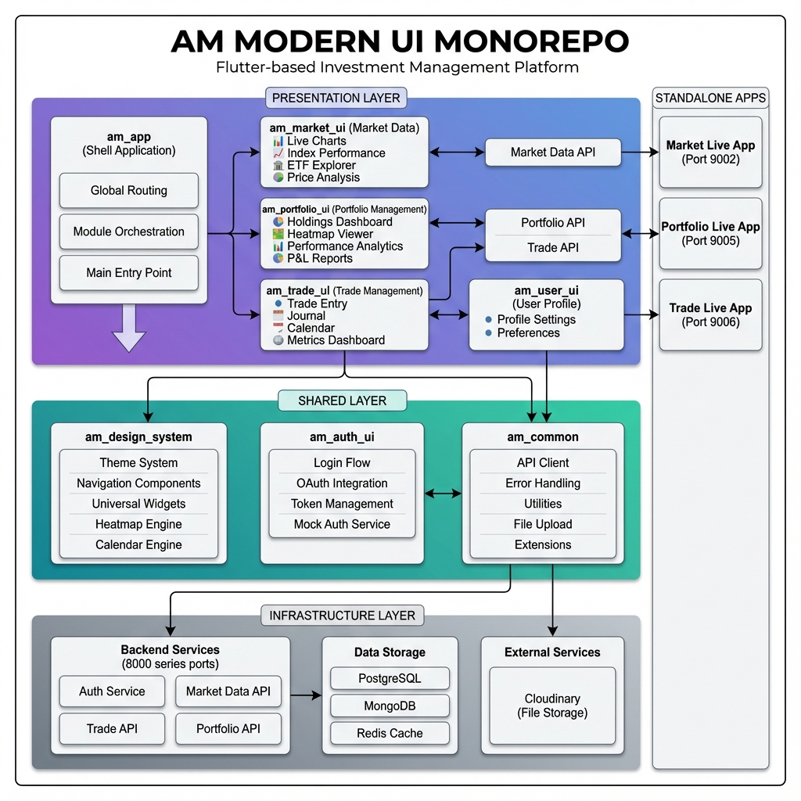

# AM Modern UI Monorepo

A comprehensive Flutter-based investment management platform built with modular architecture, featuring market data analysis, portfolio tracking, and trade management.

## 🏗️ Architecture



For detailed architecture documentation, see [ARCHITECTURE.md](./ARCHITECTURE.md)

## 🚀 Quick Start

### Prerequisites
- Flutter SDK 3.10.1+
- Dart SDK 3.0+
- Chrome (for web development)
- Docker (optional, for containerized deployment)

### Monorepo Shortcuts (Poetry)

Use the integrated Python CLI wrapper to manage the monorepo workspace efficiently. 

#### 💡 Supported Module Aliases
You can use short names instead of full directory paths for any command:
- `app` -> `am_app`
- `auth` -> `am_auth_ui`
- `design` -> `am_design_system`
- `trade` -> `am_trade_ui`
- `portfolio` -> `am_portfolio_ui`
- `market` -> `am_analysis_ui` (Market Data)
- `user` -> `am_user_ui`

---

#### 1. Code Generation (`build_runner`)
Generate files (like `.g.dart` or `.freezed.dart`) from annotations:
```bash
poetry run all-generate             # Runs code generation on ALL modules
poetry run generate <alias/dir>     # e.g., poetry run generate auth
```

#### 2. Coordinate Dependencies
```bash
poetry run all-get                  # Runs 'flutter pub get' on ALL modules
poetry run get <alias/dir>          # e.g., poetry run get auth
```

#### 3. Running Applications
```bash
poetry run app                       # Starts Main App Shell
poetry run auth                      # Starts Auth UI
poetry run trade                     # Starts Trade UI
poetry run portfolio                 # Starts Portfolio UI
```

---

### Running Standalone Apps

#### Market Data App
```bash
cd am_market_ui/live
flutter pub get
flutter run -d chrome
```

#### Portfolio Management App
```bash
cd am_portfolio_ui/live
flutter pub get
flutter run -d chrome
```

#### Trade Management App
```bash
cd am_trade_ui/live
flutter pub get
flutter run -d chrome
```

### Docker Deployment

Build and run all services:
```bash
docker-compose up -d --build
```

Access applications:
- Market UI: http://localhost:9002
- Portfolio UI: http://localhost:9005
- Trade UI: http://localhost:9006
- Main App: http://localhost:9000

## 📦 Modules

| Module | Purpose | Status |
|--------|---------|--------|
| `am_app` | Main shell application | ⚠️ In Development |
| `am_market_ui` | Market data & analysis | ✅ Production Ready |
| `am_portfolio_ui` | Portfolio tracking | ✅ Production Ready |
| `am_trade_ui` | Trade management | ⚠️ Layout Fixes Needed |
| `am_auth_ui` | Authentication | ✅ Stable |
| `am_design_system` | UI components | ✅ Stable |
| `am_common` | Shared utilities | ✅ Stable |
| `am_user_ui` | User profile | 🚧 Basic |

## 🎨 Features

### Market Data Module
- Real-time indices tracking (30+ major indices)
- Interactive TradingView charts
- ETF Explorer
- Security search
- Price validation tools

### Portfolio Module
- Multi-portfolio management
- Interactive sector heatmaps
- Performance analytics
- P&L tracking
- Asset allocation visualizations

### Trade Module
- Trade entry interface
- Rich text journal
- Calendar analytics
- Performance metrics
- Win/Loss tracking

### Authentication
- Email/Password login
- Google OAuth
- Demo mode
- JWT token management

## 🛠️ Technology Stack

- **Framework**: Flutter 3.x
- **State Management**: Bloc/Cubit + Riverpod
- **DI**: GetIt
- **Charts**: fl_chart
- **HTTP**: Dio
- **Storage**: SecureStorage

## 📁 Project Structure

```
am_modern_ui/
├── am_app/                 # Main application shell
├── am_auth_ui/            # Authentication module
├── am_common/             # Common utilities
├── am_design_system/      # Design system
├── am_market_ui/          # Market data module
│   └── live/              # Standalone app
├── am_portfolio_ui/       # Portfolio module
│   └── live/              # Standalone app
├── am_trade_ui/           # Trade module
│   └── live/              # Standalone app
└── am_user_ui/            # User profile module
```

## 🔒 Security

- JWT-based authentication
- Secure token storage
- OAuth integration
- Route guards with AuthWrapper

## 📊 Port Allocation

### UI Applications (9000 Series)
- 9000: Main App Shell
- 9002: Market UI
- 9005: Portfolio UI
- 9006: Trade UI

### Backend Services (8000 Series)
- 8001: Auth Token Service
- 8002: User Management
- 8020: Market Data API
- 8040: Trade API
- 8060: Portfolio API

## 🤝 Contributing

This is a private repository. For access or collaboration inquiries, please contact the maintainers.

## 📄 License

Copyright © 2026 AM Portfolio. All rights reserved.

## 📞 Support

For technical questions or issues, please contact the development team.

---

**Version**: 1.0.0  
**Last Updated**: January 5, 2026  
**Repository**: https://github.com/AM-Portfolio/am-modern-ui