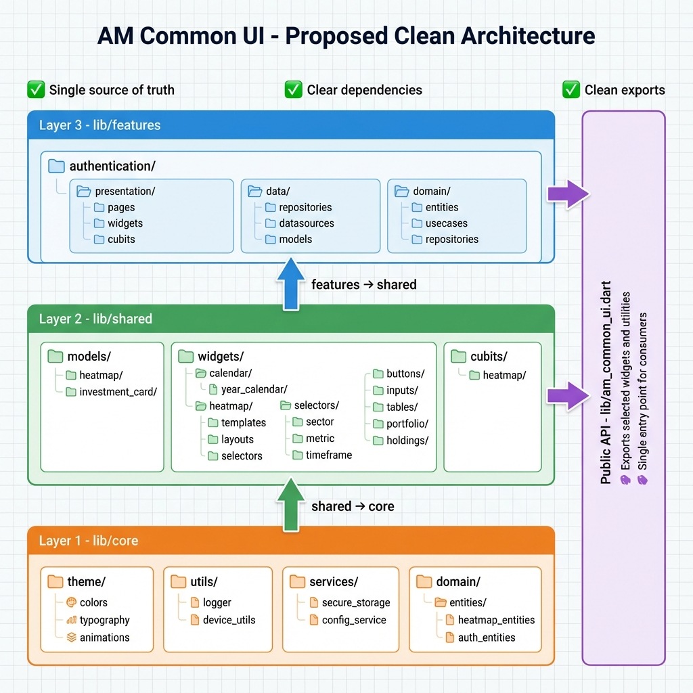

# AM Common UI - Architecture Documentation

## Overview
This document describes the clean architecture of the `am_common_ui` Flutter package - a shared UI component library for the AM Investment ecosystem.

## Architecture Diagram


## Directory Structure

```
lib/
├── core/                          # Foundation layer
│   ├── theme/                     # App theming (colors, typography, animations)
│   ├── utils/                     # Utilities (logger, device_utils)
│   ├── services/                  # Core services (secure_storage, config_service)
│   └── domain/
│       └── entities/              # Domain entities (heatmap_entities, auth_entities)
│
├── shared/                        # Shared components layer
│   ├── models/                    # Data models for widgets
│   │   ├── heatmap/
│   │   └── investment_card/
│   ├── widgets/                   # Reusable UI components
│   │   ├── calendar/
│   │   │   └── year_calendar/    # ✅ SINGLE SOURCE
│   │   ├── heatmap/               # ✅ SINGLE SOURCE
│   │   │   ├── configs/
│   │   │   ├── templates/
│   │   │   ├── layouts/
│   │   │   └── universal_heatmap/
│   │   ├── selectors/             # Common selectors (sector, metric, timeframe)
│   │   ├── buttons/
│   │   ├── inputs/
│   │   ├── tables/
│   │   ├── portfolio/
│   │   └── holdings/
│   └── core/
│       └── cubits/                # State management
│           └── heatmap/
│
├── features/                      # Feature modules
│   └── authentication/            # Auth feature
│       ├── presentation/          # UI layer (pages, widgets, cubits)
│       ├── data/                  # Data layer (repositories, datasources, models)
│       └── domain/                # Domain layer (entities, usecases, repositories)
│
└── am_common_ui.dart             # Public API (single entry point)
```

## Design Principles

### 1. Single Source of Truth
- Each widget/component exists in **only one location**
- No duplicates between `lib/widgets/` and `lib/shared/`
- All heatmap components: `lib/shared/widgets/heatmap/`
- All calendar components: `lib/shared/widgets/calendar/`

### 2. Clear Layering
```
Features Layer (lib/features/)
    ↓ depends on
Shared Layer (lib/shared/)
    ↓ depends on
Core Layer (lib/core/)
```

### 3. Clean Dependencies
- **Core** has NO dependencies on other layers
- **Shared** depends only on Core
- **Features** can depend on Shared and Core
- No circular dependencies

### 4. Public API
- `lib/am_common_ui.dart` is the single entry point
- Selectively exports public widgets and utilities
- Internal implementation details remain private

## Component Organization

### Heatmap Components
**Location:** `lib/shared/widgets/heatmap/`

```
heatmap/
├── configs/                  # Configuration models
│   ├── display_config.dart
│   ├── layout_config.dart
│   ├── selector_config.dart
│   ├── interaction_config.dart
│   └── visual_config.dart
├── layouts/                  # Layout builders
│   ├── treemap_layout_builder.dart
│   ├── grid_layout_builder.dart
│   └── list_layout_builder.dart
├── templates/                # Platform templates
│   ├── mobile_heatmap_defaults.dart
│   └── web_heatmap_defaults.dart
├── universal_heatmap/        # Universal composable system
│   ├── config_manager.dart
│   ├── template_factory.dart
│   └── types.dart
├── heatmap_display_template.dart
├── heatmap_layout_template.dart
└── heatmap_selector_template.dart
```

### Calendar Components
**Location:** `lib/shared/widgets/calendar/year_calendar/`

### Selectors
**Location:** `lib/shared/widgets/selectors/`

Contains reusable selector widgets:
- `sector_selector.dart` (with SectorType enum)
- `metric_selector.dart` (with MetricType enum)
- `timeframe_selector.dart` (with TimeFrame enum)
- `market_cap_selector.dart` (with MarketCapType enum)
- `heatmap_layout_selector.dart` (with HeatmapLayoutType enum)

## Migration Notes

### Removed Duplicates
The following directories were **removed** as they were duplicates:
- ❌ `lib/widgets/calendar/year_calendar/` → Use `lib/shared/widgets/calendar/year_calendar/`
- ❌ `lib/widgets/charts/heatmap/` → Use `lib/shared/widgets/heatmap/`

### Kept Unique Components
- ✅ `lib/widgets/charts/portfolio_charts/` (unique, not duplicated)
- ✅ `lib/widgets/animations/` (unique UI animations)

## Usage Example

```dart
// Import the package
import 'package:am_common_ui/am_common_ui.dart';

// All public widgets and utilities are available
// - Theme components
// - Common widgets (buttons, inputs, tables)
// - Heatmap components
// - Calendar components
// - Authentication widgets
```

## Refactoring Checklist

- [x] Identify all duplicate components
- [x] Create architecture documentation
- [ ] Remove duplicate directories
- [ ] Update all imports to point to shared location
- [ ] Update am_common_ui.dart exports
- [ ] Run tests to ensure no breakage
- [ ] Update consumer apps to use new import paths

## Maintenance Guidelines

1. **Adding New Widgets:**
   - Place in `lib/shared/widgets/` if reusable across apps
   - Place in `lib/features/` if specific to a feature (like auth)

2. **Adding New Models:**
   - Place in `lib/shared/models/` if used by widgets
   - Place domain entities in `lib/core/domain/entities/`

3. **State Management:**
   - Feature-specific: in feature's `presentation/cubit/`
   - Shared: in `lib/shared/core/cubits/`

4. **Exports:**
   - Always update `lib/am_common_ui.dart` when adding public APIs
   - Keep internal implementation details private

---

**Last Updated:** 2025-12-31
**Version:** 1.0.0
