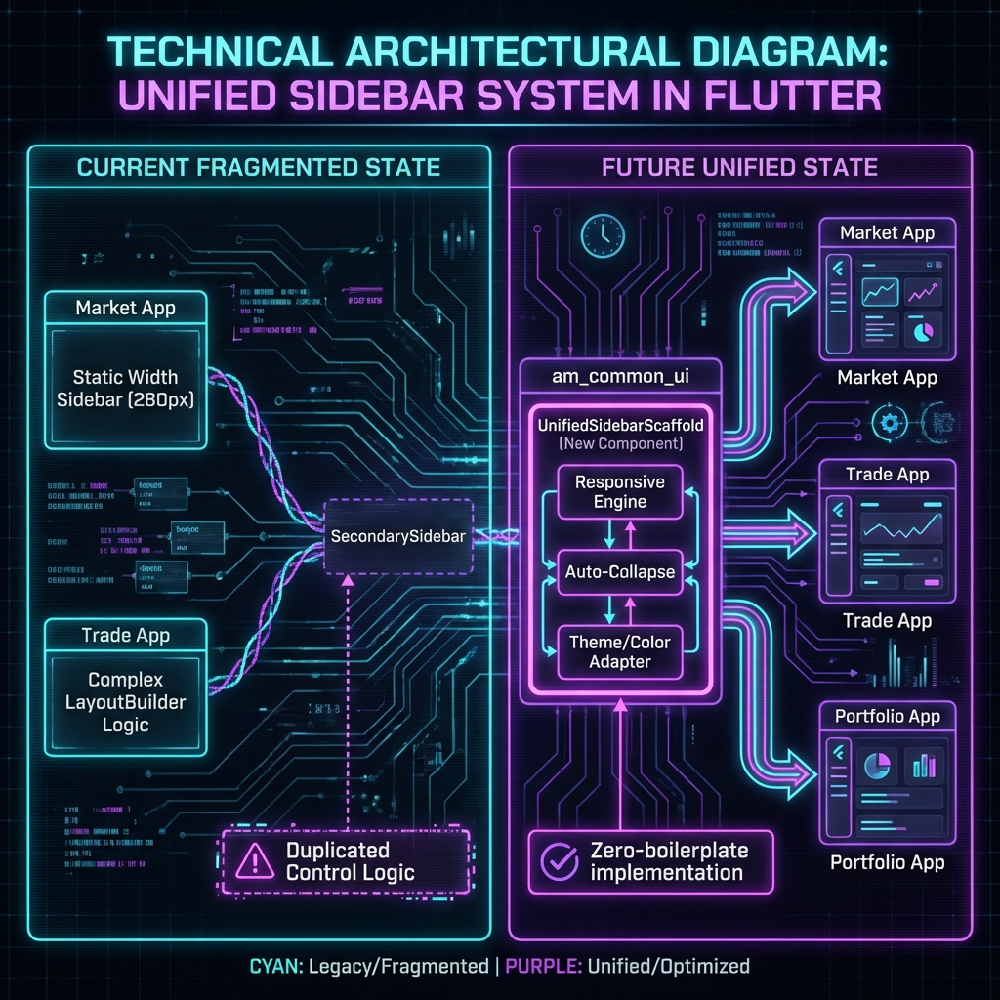

# Unified Sidebar Implementation Plan (am_common_ui)

## Overview
This plan details the creation of the `UnifiedSidebarScaffold` component within `am_common_ui`. This component will centralize the logic for responsiveness, theming, and animation, eliminating duplication in consuming applications (Market, Investment UI).

## Architecture Diagram


## Phase 1: Core Component Implementation (am_common_ui)

### 1.1 Create `UnifiedSidebarScaffold`
**Location**: `lib/shared/widgets/scaffold/unified_sidebar_scaffold.dart`

**Features**:
*   **Responsive LayoutBuilder**:
    *   **Mobile (< 800px)**: Uses `Drawer` mode.
    *   **Tablet (800px - 1200px)**: Auto-collapses to `Compact` (Icon only) mode.
    *   **Desktop (> 1200px)**: Expands to `Full` standard width.
*   **Animation Controller**: Manages the smooth width transition (60px <-> 280px).
*   **Theme Integration**: Accepts `moduleAccentColor` and automatically applies it to the internal `SecondarySidebar`.
*   **Content Slot**: Accepts a standard `body` widget.

### 1.2 Update `SecondarySidebar`
**Location**: `lib/shared/widgets/navigation/secondary_sidebar.dart`

**Updates**:
*   Ensure it accepts an external `width` parameter controlled by the parent scaffold.
*   Verify "Icon Only" mode rendering is pixel-perfect (already largely done).

## Phase 2: Migration (Consuming Apps)

### 2.1 Market Data (`am-market-web`)
*   **Target**: `lib/screens/home_page.dart`
*   **Action**: Replace the custom `Row` + `AppSidebarGlassmorphic` with:
    ```dart
    UnifiedSidebarScaffold(
      title: 'Market Data',
      activeItem: _selectedId,
      items: [ ... ],
      body: _buildContent(),
    )
    ```

### 2.2 Investment UI (`am-investment-ui`)
*   **Targets**: `TradeWebScreen`, `PortfolioWebScreen`
*   **Action**:
    *   Delete `responsive_sidebar.dart` (Legacy).
    *   Delete custom `LayoutBuilder` logic in screens.
    *   Wrap content in `UnifiedSidebarScaffold`.

## Phase 3: Cleanup
*   Remove `AppSidebarGlassmorphic` (Market) if fully replaced.
*   Remove `TradeSidebarContainer` (Investment) logic if fully replaced.

## Success Criteria
1.  **Uniformity**: All 3 apps (Market, Trade, Portfolio) look identical in styling.
2.  **Responsiveness**: All 3 apps automatically switch to "Icon Mode" on tablets.
3.  **Code Reduction**: Significant reduction in layout boilerplate in consuming apps.
