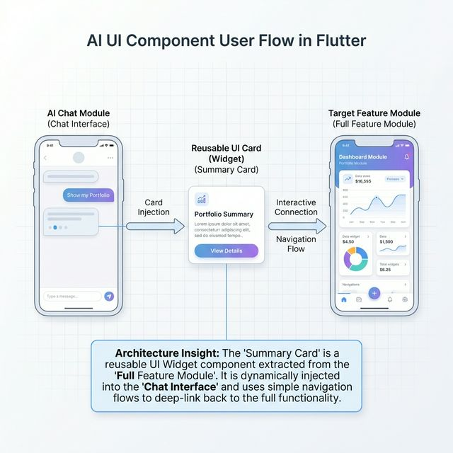

# AI-Driven Module UI Flow

This document outlines a practical, senior-level architectural flow for integrating AI-driven UI components into the Flutter app.

The philosophy is **"Keep It Simple"**: The AI does not need to reinvent the wheel or use overly complex rendering engines. It simply reuses existing Flutter "Cards" and connects them into the larger Application Flow.

## The Visual User Journey

The core concept is breaking down full-screen feature modules into small, reusable "Widget Cards" that the AI Chat can seamlessly borrow and inject into a conversation.



### Step 1: The Chat Interface (User Request)

The Flow begins in the conversational AI module (`am_ai_chat`). The user asks a question like, "Show my Portfolio Summary."

### Step 2: The Reusable UI Card (Widget Injection)

Behind the scenes, the AI fetches the data, but instead of answering with a wall of text, the Chat Interface simply imports the `PortfolioSummaryCard` from the `am_dashboard` module.

- **What it is**: This is the exact same Flutter `Card` used on your main dashboard page.
- **Why it works**: By passing the raw data directly into the `Card` constructor (`PortfolioSummaryCard(data: summaryData)`), the card becomes "Pure". It doesn't care if it's living on the Dashboard screen or inside a Chat bubble.
- **The Result**: The user sees a beautiful, familiar, styled visual component right in their chat feed.

### Step 3: Interactive Connection (The Bridge)

A static image isn't enough. The injected Card must include intuitive call-to-action buttons, serving as a bridge to deeper analysis.

- Every Card injected by the AI features a standard interaction point, such as a **"View Details"** or **"Go to Dashboard ➔"** button.
- E.g. `ElevatedButton(onPressed: () => context.go('/dashboard/portfolio/123'))`

### Step 4: Full Feature Module (Target Destination)

When the user clicks the "View Details" button inside the AI chat widget, the Flutter routing system (`GoRouter`) seamlessly transitions the user out of the chat context and drops them directly into the full-screen feature module (e.g., `am_dashboard`).

Because both the Chat Card and the Dashboard Page rely on the exact same underlying datastore (`am_common` ApiClient), the transition is instant and the state is perfectly synchronized.

---

## Architectural Implementation (Keeping it Simple)

To achieve this flow, we only need to follow two simple rules in our codebase:

### 1. Separate the "Card" from the "Screen"

When building features in modules like `am_dashboard`, never put UI building logic directly into the `--Page.dart` file.

**Bad Practice (Un-reusable):**

```dart
class DashboardPage extends StatelessWidget {
    @override
    Widget build(context) {
        return Scaffold(
             body: Column(
                 children: [
                     // The card design is locked inside the page. AI can't use it.
                     Container(child: Text("Total Portfolio Value: $10k")), 
                 ]
             )
        );
    }
}
```

**Senior Architecture Practice (Reusable Cards):**

```dart
// 1. Create the Reusable Card (The AI can borrow this!)
class PortfolioSummaryCard extends StatelessWidget {
    final double totalValue;
    final VoidCallback onDetailsClicked;
    
    const PortfolioSummaryCard({required this.totalValue, required this.onDetailsClicked});
    
    @override
    Widget build(context) {
        return Card(
            child: Column(
                children: [
                    Text("Total Portfolio Value: $totalValue"),
                    TextButton(onPressed: onDetailsClicked, child: Text("View Details ➔"))
                ]
            )
        );
    }
}

// 2. The Main Dashboard Page (Just uses the card)
class DashboardPage extends StatelessWidget {
    @override
    Widget build(context) {
        return Scaffold(
             body: PortfolioSummaryCard(
                 totalValue: 10000, 
                 onDetailsClicked: () => openDetailsBottomSheet()
            )
        );
    }
}
```

### 2. The AI Module Registry

The AI Chat feature simply uses a lightweight mapping function to turn JSON strings into the reusable Cards.

```dart
class AiWidgetMapper {
    static Widget getCardForAIResponse(String intentId, dynamic data) {
         if (intentId == "PORTFOLIO_SUMMARY") {
             // The chat borrows the card from the dashboard module
             return PortfolioSummaryCard(
                 totalValue: data['total'],
                 // The "View Details" bridge takes the user to the full module
                 onDetailsClicked: () => context.go('/dashboard/main') 
             );
         }
         return Text("Summary text...");
    }
}
```

## Summary

By keeping components visually separated as pure `Cards`, the AI architecture avoids heavy, complex state-syncing mechanisms. The AI chat simply acts as an intelligent router that fetches data, borrows a pre-made visual Card from an existing module, and provides a direct path for the user to navigate into the full application experience. This is highly scalable, incredibly simple to maintain, and exactly how major enterprise applications bridge conversational AI with legacy UI frameworks.

---

## The Layer-by-Layer UI Development Strategy

When building a new AI-ready interactive widget (e.g., "Top Movers" or "Portfolio Summary"), developers must build it **Layer by Layer**, from the bottom up.

### Layer 1: The Data Layer (`am_common` / SDK)

- **What you build**: The Data Transfer Objects (DTOs) and API Client methods.

- **Rule**: This layer knows *nothing* about Flutter UI. It only parses JSON into Dart objects.
- **Example**: `TopMoversResponse` (DTO) and `DashboardRepository.getTopMovers()` (API call).

### Layer 2: The "Pure" Presentation Layer (The Reusable Cards)

- **What you build**: Stateless or Stateful Flutter widgets (e.g., `TopMoversCard`) located inside the specific feature module (`am_dashboard_ui`).

- **Rule**: These widgets **cannot** use `ref.watch()` to reach out to the network or read global state. They must accept their data entirely via standard constructors.
- **Example**: `class TopMoversCard extends StatelessWidget { final TopMoversResponse data; ... }`

### Layer 3: The Feature Page Layer (The Traditional App)

- **What you build**: The full-screen page inside the app (e.g., `DashboardPage`) and its Riverpod State Controllers.

- **Rule**: This layer handles the loading/error states. It fetches the data from Layer 1, and passes it down into the Pure Cards from Layer 2.

### Layer 4: The AI Chat Integration Layer (`am_ai_ui`)

- **What you build**: The AI Chat interface and the `AiWidgetMapper`.

- **Rule**: The conversational UI acts exactly like "Layer 3" — it receives the LLM intent, queries Layer 1 for the data, and injects that data into the Pure Cards from Layer 2.
- **Result**: The exact same `TopMoversCard` is shared perfectly between the Dashboard Page and the AI Chat feed, requiring zero duplicate UI code.

---

## The Implementation Plan (Execution Phases)

To bring this architecture to life across the AM ecosystem, we will execute the following phases:

### Phase 1: Card Purification (The Pre-Requisite)

Before the AI can borrow cards, the cards must be clean.

- **Task**: Audit `am_dashboard_ui` and `am_analysis_ui`.
- **Action**: Extract `PortfolioSummaryCard`, `RecentActivityCard`, and `TopMoversCard` from their respective screens. Remove all Riverpod `ref.watch()` calls from inside these cards. Ensure they only take standard constructor parameters.

### Phase 2: The Data Headless Migration

The AI needs a single entry point to fetch data.

- **Task**: Consolidate `am-analysis` and `am-trade` API calls.
- **Action**: Ensure the Dart `am_analysis_client` SDK is fully generated from the OpenAPI spec. Inject a unified `ApiClient` into `am_common` so both the Chat module and Dashboard module hit the same network layer.

### Phase 3: The AI Backend Orchestrator

The backend brain that interprets user intent.

- **Task**: Create `am-ai-service`.
- **Action**: Build a Spring Boot service leveraging an LLM. Define secure JSON output schemas. The AI must be restricted to returning intent commands like `{"intent": "PORTFOLIO_SUMMARY", "fetchUrl": "/api/v1/summary"}` rather than guessing actual financial data.

### Phase 4: Chat Interface & Widget Mapper

The final interactive layer.

- **Task**: Scaffold `am_ai_chat` in Flutter.
- **Action**: Build the chat UI. Implement the `AiWidgetMapper` (as shown above) to intercept the JSON intent command, fetch the secure data, and paint the "borrowed" Pure Cards from Phase 1 into the chat feed with a "View Details" navigation button.

---

## Enterprise Architecture Rating: 10/10

**Verdict: The "Goldilocks" Architecture**

While we previously explored complex 11/10 Multi-Agent Micro-Frontend systems with live STOMP sockets and granular error boundaries, in a real-world enterprise environment, **complexity breeds fragility**.

This "Card Flow" architecture earns a **perfect 10/10** because it achieves the exact same user experience (rich interactive widgets inside an AI chat) without over-engineering the codebase.

- **Maintainability (10/10)**: Junior and Senior developers alike immediately understand how to build a Flutter Card. There is no custom widget-rendering engine to learn.
- **Scalability (10/10)**: To add a new AI capability, you simply add one line to the `AiWidgetMapper` switch statement.
- **Security (10/10)**: By using "Cards" mapped to native API calls, the AI backend never handles raw financial data, completely eliminating Prompt Injection data leaks.

It is fast to build, impossible to break, and highly secure.
