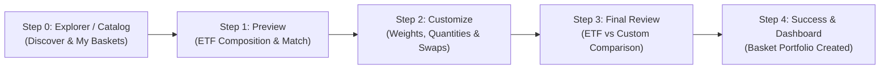
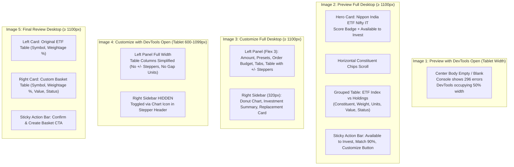
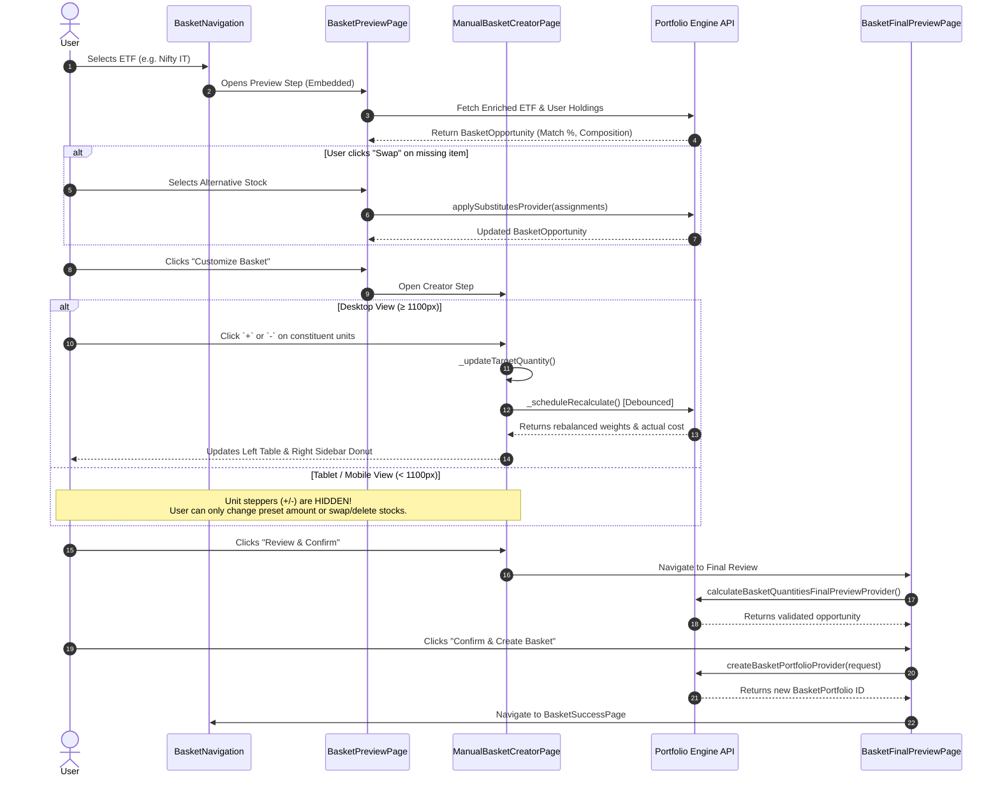

# Basket UI: Comprehensive Mobile vs Tablet vs Desktop Architectural & Functional Comparison

This document provides a component-by-component, widget-by-widget, and flow-by-flow comparison of the **AM Basket Investment UI** across **Mobile (< 600px)**, **Tablet (600px – 1099px)**, and **Desktop (≥ 1100px)** viewports.

It also incorporates an analysis of the provided runtime screenshots (Images 1 to 5), diagnosing visible elements, hidden widgets, layout differences, and root causes of viewport rendering behaviors.

---

## 1. Executive Summary & Responsive Architecture

The Basket system (`am_portfolio_ui/lib/features/basket`) uses a 4-step progressive disclosure flow embedded within the Portfolio module:



### Breakpoint Matrix (`AmBreakpoints` & `BasketResponsive`)

The application enforces viewport rules via `AmBreakpoints` (`am_design_system/lib/core/constants/breakpoints.dart`) and `BasketResponsive` (`am_portfolio_ui/.../utils/basket_responsive.dart`):

| Viewport Tier | Width Threshold | Breakpoint Helper | Primary UI Strategy |
| :--- | :--- | :--- | :--- |
| **Mobile** | `width < 600px` | `AmBreakpoints.isMobile` / `useCompactPreview` | Single vertical scroll, stacked cards, horizontally scrolling chip bars, hidden sidebars, touch-first popups. |
| **Tablet** | `600px ≤ width < 1100px` | `AmBreakpoints.isTablet` / `useScrollablePreviewTable` | Single column with off-canvas slide-out summary drawer (320px), horizontally scrollable tables (min 560px), simplified row columns. |
| **Desktop** | `1100px ≤ width < 1600px` | `AmBreakpoints.isDesktop` | 2-column split (3 flex left panel : 320px fixed right sidebar), full data tables with interactive quantity steppers, hover states. |
| **Wide Desktop** | `width ≥ 1600px` | `AmBreakpoints.isWideDesktop` | Full width multi-column grid layout, spacious table cell padding, expanded data columns. |

---

## 2. Visual Breakdown of Provided Screenshots (Images 1–5)



### Analysis of Image 1 (Blank Preview in Split Screen)
- **Observation:** In Image 1, the browser is split 50/50 with DevTools. The top stepper ("1 Preview") and bottom sticky bar are visible, but the middle content area is completely black/empty. DevTools shows **296 errors**.
- **Root Cause:** In `BasketPreviewPage`, the scrollable content is wrapped in a `CustomScrollView` inside an `Expanded` widget. When DevTools narrows the viewport below 600px or between 600–1099px, if `PreviewTableLayout` constraints or unbounded nested flex widgets clash with Flutter Web layout calculation, an assertion error is thrown repeatedly during painting, leading to an empty sliver viewport.
- **Contrast with Image 2:** Image 2 shows the exact same page in full desktop mode where all constraints are satisfied, showing the hero banner, chips, and grouped tables.

### Analysis of Image 3 vs Image 4 (Customize Desktop vs Tablet)
- **Desktop (Image 3):**
  - Two columns visible simultaneously: Left table + Right sidebar.
  - Right sidebar displays: Allocation Donut (54% match), Investment Summary, and "What You Have vs What You Need" card with "Find Replacement" CTA.
  - Table shows 7 distinct columns with interactive `+` and `-` unit stepper buttons, gap units, and individual basket value per stock.
- **Tablet / Split View (Image 4):**
  - Right sidebar is completely missing from inline view! It is shifted to an off-canvas drawer triggered by the small graph icon button next to the stepper.
  - Table header is completely omitted (`if (!isMobile && !isTablet)`).
  - The rows switch to `CustomizeConstituentRowTablet`: only shows Symbol + Sector, Status badge, ETF weight, and Invested value. **The quantity increment/decrement buttons (`-` and `+`) and Gap vs ETF units disappear entirely!**

### Analysis of Image 5 (Final Review Desktop)
- Two side-by-side cards (`FpEtfPanel` and `FpBasketPanel`).
- Left card: Original ETF composition.
- Right card: Custom Basket composition with coverage metrics (81% coverage, 6 Held, 3 Substituted).
- On mobile/tablet, this layout transitions into a vertically stacked column.

---

## 3. Step-by-Step Widget & Component Visibility Matrix

The following table comprehensively details what every widget and element displays across Mobile, Tablet, and Desktop:

| Flow Step | Widget / Component | Desktop (≥ 1100px) | Tablet (600–1099px) | Mobile (< 600px) | Functional Behavior & Differences |
| :--- | :--- | :--- | :--- | :--- | :--- |
| **All Steps** | `BasketFlowStepper` | Full width, steps 1–4 horizontal with labels & checkmarks | Steps 1–4 horizontal, compact spacing + Drawer toggle button | Steps 1–4 compact, labels may truncate or hide | On Tablet/Mobile, stepper hosts the slide-out summary drawer icon button (`Icons.bar_chart_outlined`). |
| **All Steps** | `BasketStickyActionBar` | Sticky bottom bar, 4 stats + Back + Primary CTA | Sticky bottom bar, 4 stats + Back + Primary CTA | Sticky bottom bar, compact stat wrap or stacked CTA | Primary button advances flow: *Customize Basket* → *Review & Confirm* → *Confirm & Create*. |
| **Step 1: Preview** | `PreviewHeroHeader` | Horizontal banner: Icon + Title + ISIN + Description + Score Badge on Left; Available + Count on Right | Same as desktop or reduced horizontal padding | Vertical stack: Title & Icon top row; Score badge pill second row; Available to Invest & Count bottom row | Desktop has full typography; Mobile condenses labels and wraps badges to save vertical space. |
| **Step 1: Preview** | Top ETF Constituents Chips | Horizontal scrolling row of pills (`SingleChildScrollView`) | Horizontal scrolling row of pills | Horizontal scrolling row of pills (smaller text/padding) | Shows constituent symbols and ETF target weights (e.g. `INFY 27.3%`). |
| **Step 1: Preview** | `PreviewSectionHeader` | Category title, subtitle, count badge, status color indicator | Same as desktop | Same as desktop with compact padding | Groups items into *Held in Portfolio*, *Automatically Substituted*, and *Missing / Swap Required*. |
| **Step 1: Preview** | `PreviewTableLayout` Header | Full headers: `Constituent`, `Weight`, Divider, `Units`, `Value`, `Status` | Horizontal scrolling header if width < 1100px | **Hidden / Replaced by Card Labels** | Mobile does not use table column headers. |
| **Step 1: Preview** | `PreviewStockRow` | Single-line table row aligned to grid, avatar, weight, held units, value @ price, status badge, swap CTA | Single-line table row inside horizontal scroll container (min-width 560px) | **Stacked Card Format**: Avatar + Symbol top; Weight + Value + Status wrapped below | On Desktop/Tablet, missing items show an inline "Swap" button. On Mobile, it renders as a card with an inline swap button. |
| **Step 2: Customize** | Layout Strategy (`customize_basket_layouts.dart`) | **2-Column Split**: Flex 3 Left Panel + 320px Right Sidebar | **Single Column + Off-canvas Drawer**: Left Panel full width, Right Sidebar slides out from right | **Single Column**: Left panel only. Sidebar details omitted or bottom sheet | In Tablet, opening drawer dims background. In Desktop, sidebar is always open with collapse toggle. |
| **Step 2: Customize** | Investment Amount Box | Editable box with pencil icon, currency symbol, and formatted amount | Editable box with pencil icon | Editable box with pencil icon | Tapping pencil enables `TextField` mode; editing triggers recalculation debounce. |
| **Step 2: Customize** | Quick Preset Chips (`₹25K`, `₹50K`, `₹1L`, `₹2L`, `₹5L`, `Custom`) | `Wrap(spacing: 6, runSpacing: 6)` | `Wrap(spacing: 6, runSpacing: 6)` | `SingleChildScrollView(scrollDirection: Axis.horizontal)` | On Mobile, chips do not wrap (prevents taking up vertical screen real estate); scrolls horizontally instead. |
| **Step 2: Customize** | `CustomizeActualCostBanner` | Full banner with actual cost, variance, and held coverage | Full banner | Full banner with condensed text | Informs user how much fresh cash vs held stock value will be used. |
| **Step 2: Customize** | Minimum Investment Warning | Shown if investment < ₹50,000 | Shown if investment < ₹50,000 | Shown if investment < ₹50,000 | Warning styling (`context.statusWarning`). |
| **Step 2: Customize** | Filter TabBar (`All`, `Held`, `Subst.`, `Missing`, `Excl.`) | Scrollable tab bar with counts | Scrollable tab bar with counts | Scrollable tab bar with counts | Filters constituent list by status. |
| **Step 2: Customize** | Table Header | **Visible**: `Asset`, `Allocation`, `Your Holding`, `In Basket`, `Gap vs ETF`, `Basket Value`, `Action` | **HIDDEN** | **HIDDEN** | Tablet and Mobile have NO table header row! |
| **Step 2: Customize** | Constituent Row Implementation | `CustomizeConstituentRowDesktop` (Height 56px) | `CustomizeConstituentRowTablet` (Height 52px) | `CustomizeConstituentRowMobile` (Card with 10px radius) | **Crucial functional divergence! (See Section 4)** |
| **Step 2: Customize** | Quantity Stepper (`-` and `+` buttons) | **Visible & Interactive** | **HIDDEN** | **HIDDEN** | Only Desktop users can manually adjust constituent unit quantities! |
| **Step 2: Customize** | Direct Unit Input (`TextField`) | **Visible** (Clicking units box opens input) | **HIDDEN** | **HIDDEN** | Only Desktop users can type custom target unit quantities. |
| **Step 2: Customize** | Gap vs ETF Pill (`+N` / `-N`) | **Visible** (Color-coded green/orange) | **HIDDEN** | **HIDDEN** | Shows difference between ETF ideal units and user's basket units. |
| **Step 2: Customize** | Row Action Icons | Inline icons: `Delete`, `Swap`, `Undo` (Restore) | Inline buttons: `Delete`, `Swap`, `Restore` | **3-Dots Overflow Menu (`...`)** with popup menu for Remove/Substitute, or explicit Swap button | Mobile uses popup menu to prevent button crowding. |
| **Step 2: Customize** | Right Sidebar: Donut Chart | **Visible Inline** (Donut chart, Match %, Held/Subst/Missing breakdown) | **In Slide-out Drawer Only** | **NOT VISIBLE** | Match gauge with animated segments. |
| **Step 2: Customize** | Right Sidebar: Investment Summary | **Visible Inline** (Total, Available, Min Recommended) | **In Slide-out Drawer Only** | **NOT VISIBLE** | Summary metrics. |
| **Step 2: Customize** | Right Sidebar: "What You Have vs What You Need" | **Visible Inline** (Missing list + "Find Replacement" button) | **In Slide-out Drawer Only** | **NOT VISIBLE** | Quick shortcut to open substitute selector for missing stocks. |
| **Step 3: Final Review** | Layout Strategy (`basket_final_preview_page.dart`) | **2-Column Side-by-Side** (`Row` with 2 `Expanded` panels) | **Single Column Stacked** (`Column` with ETF card top, Basket card bottom) | **Single Column Stacked** (`Column` with ETF card top, Basket card bottom) | Side-by-side comparison on desktop allows immediate visual diffing. Stacked requires scrolling. |
| **Step 3: Final Review** | `FpEtfPanel` (Original ETF Card) | Left card: Header with ETF name & count, table of Symbol vs Weight % | Full width card at top of page | Full width card at top of page | Displays reference benchmark composition. |
| **Step 3: Final Review** | `FpBasketPanel` (Custom Basket Card) | Right card: Header with Coverage %, Held/Subst counts, table of Symbol, Weight %, Value, Status | Full width card below ETF card | Full width card below ETF card | Displays user's customized basket composition. |
| **Step 3: Final Review** | `FpStockRow` | Grid row with avatar, symbol, weight %, allocation ₹, status pill | Grid row with avatar, symbol, weight %, allocation ₹, status pill | `_buildCompactCard`: Avatar + Symbol + Status top row; Weight % + Allocation ₹ bottom row | Mobile uses compact 2-row card format. |
| **Step 4: Success** | `BasketSuccessPage` | Centered modal card with checkmark, created portfolio name & ID, CTA buttons | Centered modal card | Full screen view with sticky bottom action buttons | Final landing page after `CreatePortfolioRequestMapper` executes. |

---

## 4. Deep-Dive: Functional & Flow Differences



### Functional Divergence Between Desktop and Mobile/Tablet
1. **Granular Unit-Level Editing:**
   - **Desktop:** The user has total fine-grained control. They can click `+` or `-` on any constituent to increment/decrement units, or type an exact unit count into the box. This recalculates the budget, updates the `gapVsEtf`, and adjusts the custom allocation weight.
   - **Tablet & Mobile:** **This capability is completely missing.** In `CustomizeConstituentRowTablet` and `CustomizeConstituentRowMobile`, the unit steppers and text inputs are not rendered. The user can only:
     - Change the total investment amount (via chips or input box).
     - Swap a stock for an alternative.
     - Delete a stock (exclude it) or Restore it.
2. **Right Sidebar Visibility & Diagnostics:**
   - **Desktop:** Constant visual feedback. As the user alters quantities or excludes stocks, the Donut chart instantly updates its match score, and the "What You Have vs What You Need" card provides real-time alerts.
   - **Tablet:** Requires opening an off-canvas drawer via the icon button in the header.
   - **Mobile:** Completely inaccessible unless re-architected into a bottom sheet.
3. **Table Sorting & Alignment:**
   - **Desktop:** Fixed flex grid ensures all numbers, weights, and currency symbols align perfectly across all rows.
   - **Mobile:** Rendered as independent `Card` widgets with varying content heights depending on whether the stock has held shares or substitution notes.

---

## 5. Component Hierarchy Diagram

### Desktop Layout Structure (≥ 1100px)
```
BasketFlowStepper (Header)
└── Row
    ├── Left Panel (flex: 3, CustomScrollView)
    │   ├── Investment Controls (Input + Preset Chips Wrap)
    │   ├── Actual Cost Banner (Order Budget vs Held Cover)
    │   ├── Filter TabBar (All, Held, Subst, Missing, Excl)
    │   ├── Desktop Table Header (Asset, Allocation, Holding, In Basket, Gap, Value, Action)
    │   └── SliverList (Group Headers + CustomizeConstituentRowDesktop)
    │       ├── Symbol Avatar + Symbol + Avg Price + Sub Note
    │       ├── Target % vs Custom %
    │       ├── Held Units & Value
    │       ├── [ - ] In Basket Units [ + ] (Interactive Stepper)
    │       ├── Gap vs ETF Pill (+N / -N)
    │       ├── Basket Value (₹)
    │       └── Actions (Delete / Swap / Restore)
    └── Right Sidebar (width: 320px, AnimatedContainer)
        ├── CustomizeAllocationSummaryCard (Donut Chart + Breakdown)
        ├── Investment Summary Card (Total, Available, Min Recommended)
        └── What You Have vs What You Need Card (Missing items + Find Replacement CTA)
BasketStickyActionBar (Footer: Target Wt, Allocation Wt, From Holdings, Match Score, CTA)
```

### Mobile Layout Structure (< 600px)
```
BasketFlowStepper (Compact Header)
└── CustomScrollView (Full Width)
    ├── Investment Controls (Input + Preset Chips Horizontal Scroll)
    ├── Actual Cost Banner
    ├── Filter TabBar (Horizontal Scroll)
    └── SliverList (Group Headers + CustomizeConstituentRowMobile Cards)
        └── Card (margin: 8px, border)
            ├── Row 1: Status Dot + Symbol + Status Badge + [ ... ] Menu
            ├── Row 2: MiniStats (ETF Wt % | Price ₹ | Invested ₹)
            └── Row 3 (if held): Held Units @ Avg Price Badge
BasketStickyActionBar (Sticky Footer: Compact Stats + Review & Confirm CTA)
```

---

## 6. Recommendations to Resolve Inconsistencies

1. **Fix Preview Page Viewport Error (Image 1):**
   - In `BasketPreviewPage`, replace unbounded flex slivers with a responsive layout builder that guards against sub-600px widths inside split views.
   - Ensure `PreviewTableLayout` has a fallback card view rather than throwing constraint errors when the window is resized with DevTools open.
2. **Expose Unit Steppers to Tablet & Mobile:**
   - Currently, tablet and mobile users cannot fine-tune stock units. Adding a modal bottom sheet or expanding accordion for mobile/tablet rows would restore parity with Desktop.
3. **Add Summary Bottom Sheet on Mobile:**
   - The Donut chart and "What You Have vs What You Need" cards are completely hidden on mobile. Adding a floating action button or summary pill that opens a draggable bottom sheet will allow mobile users to view their allocation breakdown.
4. **Unify Table Headers:**
   - On tablet, add a simplified header above `CustomizeConstituentRowTablet` to clarify what the numbers (ETF weight vs invested amount) represent.
