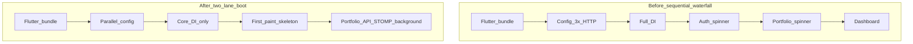
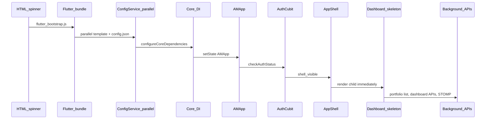
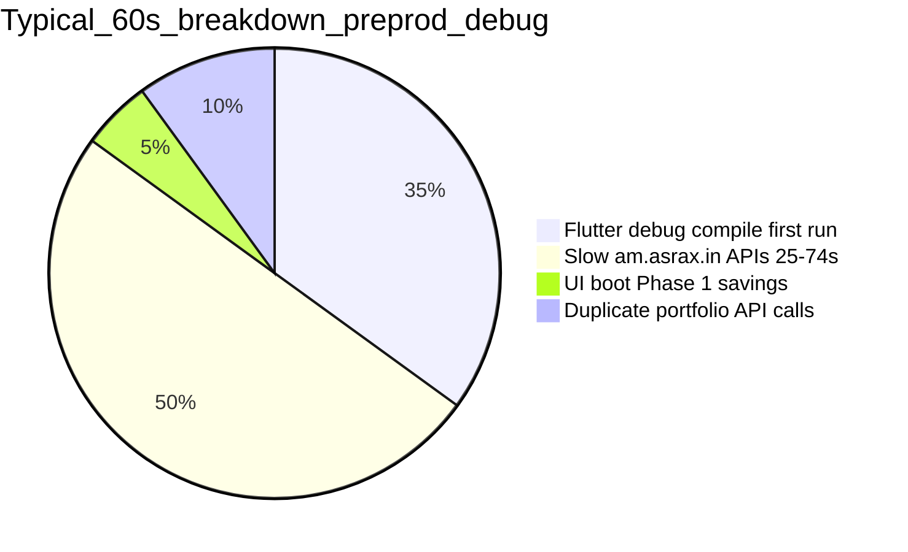

# Fast Boot Performance — Modern UI

Technical documentation for startup load-time work on the AM Investment Platform web shell (`am_app`).

**Last updated:** July 2026  
**Scope:** Phase 0 (BootTrace) + Phase 1 (critical-path) + Phase 2 (dashboard load fixes) — shipped  
**Related docs:** [LOAD_TIME_PROBLEM_ANALYSIS.md](LOAD_TIME_PROBLEM_ANALYSIS.md) | [FIRST_URL_TO_AUTH.md](FIRST_URL_TO_AUTH.md) | [PREPROD_DEPLOY_CHECKLIST.md](PREPROD_DEPLOY_CHECKLIST.md) | [CACHE_STRATEGY.md](CACHE_STRATEGY.md)

---

## Executive summary

### Problem

After commit `b2ac3f1` (Jun 2026), the app *felt* much slower because visible loading spinners replaced a blank page during startup. Investigation showed the spinners were not the root cause — they exposed a **sequential startup waterfall** that could take 8–15 seconds before dashboard content appeared.

When testing locally with `npm run run:app:preprod`, total wait can reach **60+ seconds**. That is dominated by:

1. **Flutter debug compile** on first `flutter run` (60–190s) — dev-only overhead
2. **Slow remote preprod APIs** at `am.asrax.in` (25–74s per call) — backend/network
3. **UI bootstrap gates** (2–4s) — addressed in Phase 1

### Solution: two-lane boot architecture

Separate **critical path** (must complete before first paint) from **background warmup** (portfolio list, subscription DI, STOMP, dashboard APIs).



**Core rule:** The user should never wait for portfolio list, subscription DI, or STOMP before seeing login or dashboard layout.

### Expected impact (Phase 1)

| Metric | Before | After Phase 1 | End goal Phases 2–5 |
|--------|--------|---------------|---------------------|
| Cold visit — shell visible | 8–15s | **4–6s** (release build) | 2–3s |
| Warm visit — shell visible | 5–8s | **2–4s** | 1–2s |
| Logged-in dashboard skeleton | Blocked by portfolio spinner | **Immediate** | Immediate |
| Content with API data | 10–18s+ | API-bound | ≤3s if APIs <1.5s |
| Full-screen spinners | 4 stacked | **1–2** | 0–1 |

> **Important:** Phase 1 saves ~2–4s on UI boot. It does **not** fix slow backend APIs or Flutter debug compile time. See [Real-world diagnosis](#real-world-diagnosis-60s-local-load) below.

---

## Design approach

### Critical path vs background

| Lane | Runs when | User sees |
|------|-----------|-----------|
| **Critical** | Before first paint | Login form OR dashboard skeleton |
| **Background** | After first frame | Portfolio selector fills in, chart data streams |

### Boot sequence (after Phase 1)



---

## What was implemented

### Phase 0 — BootTrace system

| Item | Detail |
|------|--------|
| **What** | `BootTrace` utility + 13 milestones from HTML load through dashboard data |
| **Why** | Measure each phase before optimizing; avoid guessing |
| **Files** | [`am_common/lib/core/telemetry/boot_trace.dart`](../am_common/lib/core/telemetry/boot_trace.dart), [`boot_trace_web.dart`](../am_common/lib/core/telemetry/boot_trace_web.dart) |
| **Direct time saved** | 0ms — enables data-driven work |

**Milestones:**

```
html_loaded → flutter_dart_ready → flutter_main_enter
→ config_start → config_done → di_core_done → di_feature_done
→ first_flutter_frame → auth_check_start → auth_check_done
→ shell_visible → portfolio_service_ready → portfolio_list_done
→ dashboard_first_data
```

**Instrumented files:**

| Milestone | File |
|-----------|------|
| HTML marks | [`am_app/web/index.html`](../am_app/web/index.html) |
| Bootstrap | [`am_app/lib/main.dart`](../am_app/lib/main.dart) |
| Config | [`am_common/lib/core/config/config_service.dart`](../am_common/lib/core/config/config_service.dart) |
| DI | [`am_app/lib/core/di/injection.dart`](../am_app/lib/core/di/injection.dart) |
| Auth | [`am_auth_ui/.../auth_cubit.dart`](../am_auth_ui/lib/features/authentication/presentation/cubit/auth_cubit.dart) |
| Shell | [`am_app/lib/features/shell/app_shell.dart`](../am_app/lib/features/shell/app_shell.dart) |
| Portfolio | [`am_portfolio_ui/.../global_portfolio_wrapper.dart`](../am_portfolio_ui/lib/features/portfolio/presentation/widgets/global_portfolio_wrapper.dart) |
| Dashboard | [`am_dashboard_ui/.../dashboard_web_screen.dart`](../am_dashboard_ui/lib/presentation/web/dashboard_web_screen.dart) |

---

### Phase 1 — Critical path optimizations

#### 1. Parallel config fetch

| | |
|---|---|
| **What** | `config.template.json` and `config.json` fetched with `Future.wait`; per-request timeout reduced from 3s to 1.5s |
| **Why** | Three sequential HTTP calls blocked bootstrap before any Flutter UI |
| **File** | [`config_service.dart`](../am_common/lib/core/config/config_service.dart) |
| **Expected savings** | **200–600ms** typical; up to **~4–6s** worst case on slow network |

**Example:**

```
Before: template (400ms) → config.json (300ms) → config.preprod.json (350ms) = 1050ms
After:  max(400, 300) + 350 = 750ms  → saves ~300ms
```

---

#### 2. Core vs feature DI split

| | |
|---|---|
| **What** | `configureCoreDependencies()` before first paint; `configureFeatureDependencies()` after first frame |
| **Why** | Subscription Dio and market analysis registration delayed dashboard mount |
| **Files** | [`injection.dart`](../am_app/lib/core/di/injection.dart), [`main.dart`](../am_app/lib/main.dart) |
| **Expected savings** | **100–300ms** off critical path |

**Core DI registers:** ServiceRegistry, Theme, Auth, Dashboard, AuthCubit, StompConnectionCubit  
**Feature DI (deferred):** Subscription, MarketAnalysisService, placeholder modules

---

#### 3. Non-blocking portfolio shell (highest UI impact)

| | |
|---|---|
| **What** | `GlobalPortfolioWrapper` renders `widget.child` immediately; portfolio provider chain loads in background |
| **Why** | Dashboard only needs `userId` but was blocked on full `portfolioServiceProvider` chain (local DB init → API client → repository → use cases) |
| **File** | [`global_portfolio_wrapper.dart`](../am_portfolio_ui/lib/features/portfolio/presentation/widgets/global_portfolio_wrapper.dart) |
| **Expected savings** | **1–3s** for logged-in users on dashboard |

**Before / after:**

```
Before: Auth OK → full-screen portfolio spinner (1-3s) → dashboard skeleton
After:  Auth OK → dashboard skeleton immediately → portfolio selector fills in
```

---

#### 4. Auth gate slim-down

| | |
|---|---|
| **What** | `AuthLoading` shows thin `LinearProgressIndicator` over content instead of full-screen spinner |
| **Why** | Shell layout visible during token restore — better perceived performance |
| **File** | [`app_shell.dart`](../am_app/lib/features/shell/app_shell.dart) |
| **Expected savings** | **Perceived** ~500ms–1s; no network time saved |

---

#### 5. Service worker version gate

| | |
|---|---|
| **What** | Unregister service workers only when `AM_BUILD_ID` in `index.html` changes (was every page load) |
| **Why** | Previous behavior cleared cache on every reload, hurting repeat visits |
| **File** | [`am_app/web/index.html`](../am_app/web/index.html) — `AM_BUILD_ID = '4'` |
| **Expected savings** | **30–50%** faster repeat visits |

> Bump `AM_BUILD_ID` and `flutter_bootstrap.js?v=` on each production deploy.

---

#### 6. npm / manage.py BootTrace support

| | |
|---|---|
| **What** | `--boot-trace` / `--no-boot-trace` CLI flags; npm scripts; `AM_BOOT_TRACE` in `.env` |
| **Files** | [`package.json`](../package.json), [`scripts/manage.py`](../scripts/manage.py), [`.env.example`](../.env.example) |

---

### Phase 2 — Dashboard load + API contention fixes (shipped)

See full problem registry: [LOAD_TIME_PROBLEM_ANALYSIS.md](LOAD_TIME_PROBLEM_ANALYSIS.md)

| Fix | What | Expected impact |
|-----|------|-----------------|
| **Defer portfolio on Dashboard** | No `loadPortfoliosList` / `loadPortfolioById` on Dashboard tab — only Portfolio/Trade | **−2 to −4 slow API calls** (24–74s each on degraded preprod) |
| **Dedupe portfolio fetch** | Skip duplicate `loadPortfolioById` for same ID | **−66%** portfolio API volume |
| **Global HTTP timeout** | 30s default on `ApiClient`; 15s on performance chart | Cap chart hang at 15s vs 53s+ |
| **Progressive dashboard** | STOMP fire-and-forget; `dashboardParallelKickoff`; keepAlive repository | Fast widgets in **~1–3s** independently |
| **Single activity fetch** | Remove duplicate `activityStream` + REST on mount | **−1 API call** |
| **BootTrace first-widget-wins** | `dashboard_first_data` on any widget, not summary only | Accurate metrics |
| **Lazy Hive init** | `ensureInitialized()` on first cache access | **100–500ms** off Dashboard path |
| **Mobile UX** | Chart moved last; "Loading chart…" label | Better perceived load |

**Key files:** `global_portfolio_wrapper.dart`, `portfolio_cubit.dart`, `api_client.dart`, `dashboard_provider.dart`, `dashboard_repository.dart`, `dashboard_web_screen.dart`, `dashboard_mobile_screen.dart`, `portfolio_local_data_source.dart`

---

## How to use BootTrace

### Enable tracing

| Method | Usage |
|--------|--------|
| npm run (local) | `npm run run:app:local` — trace ON, opens `/login?bootTrace=1` |
| npm run (preprod) | `npm run run:app:preprod` |
| URL param | Add `?bootTrace=1` to any URL (works in Docker too) |
| Persist | `localStorage.setItem('am_boot_trace', '1')` — HTML marks only |
| Disable | `npm run run:app:local:notrace` or `--no-boot-trace` |
| Env file | `AM_BOOT_TRACE=true|false` in `.env.<env>` |

### npm scripts reference

```bash
# Run — boot trace ON by default
npm run run:app:local
npm run run:app:preprod

# Run without trace
npm run run:app:local:notrace

# Release build with trace baked in (for Docker debugging)
npm run build:app:preprod:trace
npm run build:app:prod:trace

# Normal release build (trace OFF)
npm run build:app:preprod
```

### Read results

1. Open **DevTools → Console**
2. Look for `[BootTrace] +XXXms → phase_name` lines
3. After ~6s, find **AM Boot Trace Summary** table (slowest phase marked with ⚠)
4. Copy JSON: `window.__AM_BOOT_TRACE__` in console
5. Diagnostic Lab (`/app/lab`): boot events under category **Boot**

**Example console output:**

```
[BootTrace] +2840ms → flutter_dart_ready    (total 2840ms)
[BootTrace] +120ms  → config_done           (total 2960ms)
[BootTrace] +45ms   → di_core_done          (total 3005ms)
[BootTrace] +890ms  → auth_check_done       (total 3895ms)
[BootTrace] +680ms  → dashboard_first_data  (total 5815ms)

══════ AM Boot Trace Summary ══════
Phase                        Delta    Total
────────────────────────────────────────────────
flutter_dart_ready             2840ms   2840ms ⚠
auth_check_done                 890ms   3895ms
...
```

---

## Docker and production behavior

| Aspect | Behavior |
|--------|----------|
| **Performance optimizations** | Yes — compiled into release build automatically |
| **BootTrace default** | OFF in Dockerfile (`flutter build web --release` without `AM_BOOT_TRACE`) |
| **Enable trace in deployed env** | `?bootTrace=1` in browser URL |
| **Enable trace in build** | `npm run build:app:preprod:trace` before Docker image build |
| **Config loading** | Still HTTP from nginx (`/config.template.json`, `/config.json`, `/config.{env}.json`) |
| **SW cache** | Preserved until `AM_BUILD_ID` changes |

---

## Real-world diagnosis: ~60s local load

Observed when running `npm run run:app:preprod` (debug mode + remote preprod APIs).

### Where the 60 seconds actually goes



### Evidence from terminal logs

**1. Flutter debug compile (dev only)**

```
Waiting for connection from debug service on Chrome... 190.2s
```

First `flutter run` compiles the entire monorepo for web debug. This is **not** representative of Docker/production release builds.

**2. Slow preprod API responses**

| API | Observed latency |
|-----|------------------|
| `GET /analysis/dashboard/performance?timeFrame=1D` | **53,001ms** |
| `GET /portfolio/.../summary` | **24,631 – 74,040ms** |
| `GET /portfolio/.../holdings` | **26,512 – 74,093ms** |

These calls go to `https://am.asrax.in` (see [`.env.preprod`](../.env.preprod)). Phase 1 UI work cannot fix 25–74 second API responses.

**3. Duplicate portfolio fetches**

Same holdings/summary endpoints were observed firing **3×** in one session — a Phase 5 fix (dedupe + request coalescing).

**4. UI boot was fast when APIs were healthy**

In a session where debug compile had already finished:

- Config resolved: immediate
- Auth check: ~5s
- Initial dashboard APIs: ~1.6s each

### How to test UI boot fairly

| Goal | Command |
|------|---------|
| UI boot only (no debug compile) | `npm run build:app:preprod:trace` then serve `am_app/build/web` |
| Avoid remote API slowness | `npm run run:app:local` with local backend (`.env.local`) |
| Debug with trace on preprod APIs | `npm run run:app:preprod` + DevTools console BootTrace summary |

---

## Overall expected reduction (Phase 1)

**Additive estimate for logged-in dashboard (release build, healthy APIs):**

| Component | Savings |
|-----------|---------|
| Parallel config | 0.2–0.6s |
| Core DI split | 0.1–0.3s |
| Non-blocking portfolio shell | **1.0–3.0s** |
| Auth UX (perceived) | ~0.5–1s feel |
| SW cache (repeat visit) | 30–50% asset load |
| **Total cold (logged in)** | **~2–4s off 8–15s baseline → ~4–6s shell** |

**Not yet addressed:**

| Issue | Phase |
|-------|-------|
| Flutter bundle size (2–4s cold) | Phase 2 — deferred imports |
| Config HTTP at boot | Phase 3 — embed config at build |
| Slow / duplicate APIs | Phase 5 — parallel fan-out, dedupe, stale-while-revalidate |
| Debug compile overhead | Use release build for perf testing; not a production issue |

---

## Remaining roadmap (Phases 2–6)

| Phase | Focus | Target |
|-------|-------|--------|
| **2** | Deferred imports (trade, market, analysis, AI, doc-intel) | −30% initial JS bundle |
| **3** | Embed config at build time, CDN, preload hints | Warm shell 1–2s |
| **4** | Smart SW strategy + config/auth local cache | Near-instant repeat visits |
| **5** | Parallel dashboard API fan-out, dedupe fetches, stale-while-revalidate | Content ≤3s when APIs healthy |
| **6** | CI bundle budgets + RUM telemetry | No regression |

---

## Measurement runbook

### Baseline capture template

Run each scenario twice (cold + warm reload). Fill in from BootTrace summary:

| Scenario | flutter_dart_ready | config_done | di_core_done | auth_check_done | shell_visible | dashboard_first_data | Total |
|----------|-------------------|-------------|--------------|-----------------|---------------|----------------------|-------|
| Cold login | | | | | | | |
| Warm reload | | | | | | | |
| Logged-in dashboard | | | | | | | |

### Steps

1. `cd am-modern-ui`
2. `npm run run:app:local` (or `:preprod`)
3. DevTools → Console → wait for **AM Boot Trace Summary**
4. Note slowest phase (⚠ marker)
5. For fair UI-only measurement: use release build (`npm run build:app:local:trace` + static server)

### Interpret results

| Slowest phase | Likely fix |
|---------------|------------|
| `flutter_dart_ready` | Phase 2 bundle split; use release build for testing |
| `config_done` | Phase 3 embed config; check network to config JSONs |
| `portfolio_service_ready` | Phase 2 defers portfolio list on Dashboard; check Portfolio/Trade tab |
| `dashboard_first_data` | Should fire ~1–3s (first fast widget); if still 15s+ check backend P15 |
| Total ~60s with preprod | See [Real-world diagnosis](#real-world-diagnosis-60s-local-load) — likely debug compile + slow APIs |

---

## Files changed (Phase 0 + Phase 1 + Phase 2)

| File | Change |
|------|--------|
| `am_common/lib/core/telemetry/boot_trace.dart` | BootTrace utility |
| `am_common/lib/core/telemetry/boot_trace_web.dart` | Web JS interop + telemetry |
| `am_common/lib/core/telemetry/boot_trace_stub.dart` | Non-web stub |
| `am_common/lib/core/config/config_service.dart` | Parallel config fetch |
| `am_common/lib/am_common.dart` | Export BootTrace |
| `am_app/lib/main.dart` | Bootstrap + core DI + trace init |
| `am_app/lib/core/di/injection.dart` | Core vs feature DI split |
| `am_app/lib/features/shell/app_shell.dart` | Non-blocking auth gate |
| `am_app/web/index.html` | HTML boot marks + SW version gate |
| `am_portfolio_ui/.../global_portfolio_wrapper.dart` | Non-blocking shell + defer fetch on Dashboard |
| `am_portfolio_ui/.../portfolio_cubit.dart` | Dedupe `loadPortfolioById` |
| `am_portfolio_ui/.../portfolio_local_data_source.dart` | Lazy Hive init |
| `am_portfolio_ui/.../portfolio_providers.dart` | No eager Hive init |
| `am_library/lib/core/network/api_client.dart` | 30s default HTTP timeout |
| `am_auth_ui/.../auth_cubit.dart` | Auth timing marks |
| `am_dashboard_ui/.../dashboard_provider.dart` | keepAlive repo, STOMP decouple, parallel kickoff |
| `am_dashboard_ui/.../dashboard_repository.dart` | 15s performance timeout |
| `am_dashboard_ui/.../dashboard_web_screen.dart` | Progressive load, BootTrace, chart label |
| `am_dashboard_ui/.../dashboard_mobile_screen.dart` | Widget reorder, same progressive pattern |
| `am_dashboard_ui/.../dashboard_recent_activity_widget.dart` | Single REST path for activity |
| `scripts/manage.py` | `--boot-trace` / `--no-boot-trace` flags |
| `package.json` | npm scripts with trace support |
| `.env.example` | `AM_BOOT_TRACE` documented |
| `docs/LOAD_TIME_PROBLEM_ANALYSIS.md` | Detailed problem/time registry + fix status |

---

## References

- **[LOAD_TIME_PROBLEM_ANALYSIS.md](LOAD_TIME_PROBLEM_ANALYSIS.md)** — detailed what/where/time for each bottleneck (P1–P15)
- Original spinner change: commit `b2ac3f1` — bootstrap refactor (spinners are UX feedback, not the root cause)
- Mobile UI refactor doc (separate scope): [`am_app/docs/DETAILED_CHANGES_DOCUMENTATION.md`](../am_app/docs/DETAILED_CHANGES_DOCUMENTATION.md)
- Docker setup: [`DOCKER_README.md`](../DOCKER_README.md)
