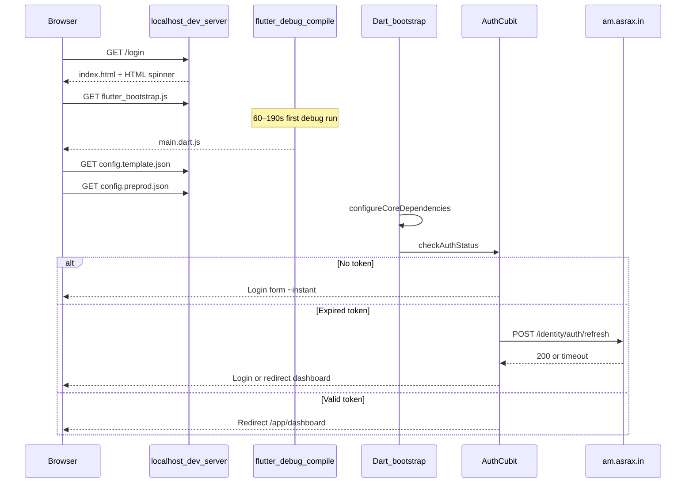

# First URL Hit → Auth — Startup Timeline (Preprod)

**Audience:** Developers testing with `npm run run:app:preprod` or deploying to preprod cluster  
**Related:** [LOAD_TIME_PROBLEM_ANALYSIS.md](LOAD_TIME_PROBLEM_ANALYSIS.md) | [FAST_BOOT_PERFORMANCE.md](FAST_BOOT_PERFORMANCE.md) | [PREPROD_DEPLOY_CHECKLIST.md](PREPROD_DEPLOY_CHECKLIST.md)

This document explains **exactly what happens** from the first browser request until the login page (or authenticated shell) appears, and **where preprod API (`am.asrax.in`) is involved**.

---

## First URL (what you actually hit)

`npm run run:app:preprod` opens:

```
http://localhost:<port>/login?bootTrace=1
```

| Fact | Detail |
|------|--------|
| Host | **localhost** — Flutter dev server (`flutter run -d chrome`) |
| Path | `/login` — router initial location ([`app_router.dart`](../am_app/lib/core/router/app_router.dart)) |
| Preprod API on first hit? | **No** — `am.asrax.in` is configured but not called yet |

Preprod is wired via [`config.preprod.json`](../am_app/web/config.preprod.json) (`"domain": "am.asrax.in"`) and [`.env.preprod`](../.env.preprod) dart-defines. Those set **future** API base URLs only.

---

## Full timeline (first visit → auth visible)



---

## Phase 1 — HTML spinner (0–1s)

| Item | Detail |
|------|--------|
| **What you see** | “Loading AM Investment Platform…” (purple spinner) |
| **File** | [`am_app/web/index.html`](../am_app/web/index.html) — `#am-boot` |
| **BootTrace** | `html_loaded` |
| **Preprod API** | None |

Browser loads `flutter_bootstrap.js?v=4` asynchronously.

---

## Phase 2 — Flutter debug compile (60–190s, dev only)

| Item | Detail |
|------|--------|
| **What you see** | Same HTML spinner — Flutter has not started |
| **Cause** | `flutter run` debug mode compiles entire monorepo before Chrome connects |
| **Evidence** | `Waiting for connection from debug service on Chrome... 190.2s` |
| **Preprod API** | None |
| **Not in production** | Release Docker build skips this entirely |

> **This is the #1 reason auth feels “very late” in local preprod testing.** Auth cannot render until Flutter finishes compiling.

---

## Phase 3 — Flutter JS download (2–5s+)

| Item | Detail |
|------|--------|
| **What happens** | Browser downloads debug `main.dart.js` from localhost |
| **BootTrace** | `flutter_dart_ready` — HTML spinner removed |
| **Preprod API** | None |

---

## Phase 4 — Dart bootstrap (2–5s)

| Item | Detail |
|------|--------|
| **What you see** | “Starting AM Investment Platform…” Flutter spinner |
| **File** | [`am_app/lib/main.dart`](../am_app/lib/main.dart) `_BootstrapApp` |
| **Steps** | 1. `ConfigService.initialize()` 2. `configureCoreDependencies()` 3. Mount `AMApp` |
| **Preprod API** | None — config is **local JSON** |

### Config files fetched (from localhost, not am.asrax.in)

| File | Timeout | Purpose |
|------|---------|---------|
| `/config.template.json` | 1.5s | Defaults |
| `/config.json` | 1.5s | Env selector |
| `/config.preprod.json` | 1.5s | Sets `domain: am.asrax.in` |

Source: [`config_service.dart`](../am_common/lib/core/config/config_service.dart)

**BootTrace:** `config_start` → `config_done` → `di_core_done`

`configureCoreDependencies()` registers auth, dashboard, STOMP clients pointing at preprod URLs — **no HTTP calls yet**.

---

## Phase 5 — Auth check (50ms – 30s+)

| Item | Detail |
|------|--------|
| **Trigger** | [`app.dart`](../am_app/lib/app.dart) — `getIt<AuthCubit>()..checkAuthStatus()` |
| **Route** | `/login` — login is **outside** AppShell ([`app_router.dart`](../am_app/lib/core/router/app_router.dart)) |
| **BootTrace** | `auth_check_start` → `auth_check_done` |

### Three auth paths

| Case | Flow | Preprod hit? | Typical time |
|------|------|--------------|--------------|
| **A — No token** | Local storage empty → `Unauthenticated` → login form | **No** | 50–300ms |
| **B — Valid token** | Read token + user from storage → `Authenticated` → redirect `/app/dashboard` | **No** | 100–500ms |
| **C — Expired token** | `POST https://am.asrax.in/identity/auth/refresh` | **Yes — first preprod call** | 1–30s (timeout) or longer if no timeout |

Case C keeps login in **`AuthLoading`** — form disabled/spinning until refresh completes:

- [`auth_repository_impl.dart`](../am_auth_ui/lib/features/authentication/data/repositories/auth_repository_impl.dart) → `checkAuthStatus()` → `refreshToken()`
- [`login_page.dart`](../am_auth_ui/lib/features/authentication/presentation/pages/login_page.dart) — `isLoading: state is AuthLoading`

### When login page actually appears

```
html_loaded
  → (debug compile gap)
  → flutter_dart_ready
  → config_done + di_core_done
  → auth_check_done
  → LoginPage visible (Case A or C failed refresh)
  OR redirect to dashboard (Case B or C success)
```

---

## Phase 6 — After auth (not login, but feels like “still loading”)

If Case B or C succeeds, GoRouter redirects to `/app/dashboard`:

1. **AppShell** — thin auth progress bar (if still loading)
2. **STOMP** — `wss://am.asrax.in/...` connects after `Authenticated`
3. **Dashboard APIs** — parallel calls to analysis/portfolio services
4. **Widget skeletons** — each panel loads independently

This is **post-auth** slowness. See [LOAD_TIME_PROBLEM_ANALYSIS.md](LOAD_TIME_PROBLEM_ANALYSIS.md) for API timings (24–102s observed on degraded preprod).

Phase 2 fixes (shipped) reduce this: no portfolio fetch on Dashboard tab, 15s chart timeout, progressive widgets.

---

## What uses preprod vs localhost (summary)

| Step | Host | Endpoint type |
|------|------|-----------------|
| First URL / HTML / JS | `localhost:9000` | Static + Flutter dev |
| Config JSON | `localhost:9000` | `/config.*.json` |
| Auth refresh (expired token) | `am.asrax.in` | `/identity/auth/refresh` |
| Login submit | `am.asrax.in` | `/identity/auth/login` |
| Dashboard data | `am.asrax.in` | `/analysis/...`, `/portfolio/...` |
| WebSocket | `am.asrax.in` | `wss://...` |

---

## How to diagnose your session

### 1. Enable BootTrace

```bash
cd am-modern-ui
npm run run:app:preprod
# Opens /login?bootTrace=1
```

### 2. Read console marks

| Gap between marks | Meaning |
|-------------------|---------|
| `html_loaded` → `flutter_dart_ready` | Debug compile + JS download |
| `flutter_dart_ready` → `config_done` | Config + DI |
| `auth_check_start` → `auth_check_done` | Auth (check Network for identity refresh) |
| `auth_check_done` → `dashboard_first_data` | Post-login API slowness |

### 3. DevTools Network filter `am.asrax.in`

| Observation | Diagnosis |
|-------------|-----------|
| No preprod requests before login form | Delay is debug compile + bootstrap |
| `identity/auth/refresh` pending 15–30s+ | Preprod auth slow (Case C) |
| `portfolios/holdings` on Dashboard landing | Old build — redeploy Phase 2 fixes |
| `dashboard/performance` 53s+ | Backend slow; UI should cap at 15s after fix |

### 4. Realistic preprod perf test (skip debug compile)

```bash
npm run build:app:preprod
# Serve am_app/build/web — matches Docker/preprod cluster behavior
```

---

## Release / preprod cluster vs local debug

| Environment | Phase 2 compile | Typical time to login |
|-------------|-----------------|----------------------|
| `npm run run:app:preprod` (debug) | 60–190s first run | Minutes |
| `npm run build:app:preprod` + serve | None | 2–5s bootstrap + auth |
| Docker preprod deploy | None (release build) | 2–5s + API bound |

---

## References

- Problem registry + fix status: [LOAD_TIME_PROBLEM_ANALYSIS.md](LOAD_TIME_PROBLEM_ANALYSIS.md)
- Shipped optimizations: [FAST_BOOT_PERFORMANCE.md](FAST_BOOT_PERFORMANCE.md)
- Deploy steps: [PREPROD_DEPLOY_CHECKLIST.md](PREPROD_DEPLOY_CHECKLIST.md)
