# Load Time Problem Analysis — Detailed Findings

**Environment observed:** `npm run run:app:preprod` (Flutter debug + remote APIs at `https://am.asrax.in`)  
**Date:** July 2026  
**Last updated:** July 2026 (Phase 2 load-time fixes shipped)  
**Related docs:** [FAST_BOOT_PERFORMANCE.md](FAST_BOOT_PERFORMANCE.md) (fixes shipped + roadmap)

This document lists **every major bottleneck**, **exact file/line area**, **measured time**, **why it happens**, and **fix status**.

---

## Fix status summary

| ID | Problem | Was (measured) | Status | Fix location |
|----|---------|----------------|--------|--------------|
| P1 | Flutter debug compile | **190s** | Open (dev-only) | Use release build for perf testing |
| P2 | Slow performance API | **53s** | **Fixed (UI cap)** | 15s timeout in `dashboard_repository.dart` |
| P3 | Portfolio fetch on Dashboard | **24–74s × 2–4 calls** | **Fixed** | `global_portfolio_wrapper.dart` |
| P4 | Duplicate portfolio calls | **3×** same endpoints | **Fixed** | `portfolio_cubit.dart` dedupe |
| P5 | No HTTP timeout | Hangs until server | **Fixed** | `api_client.dart` 30s default |
| P6 | Duplicate recent-activity | **2×** at mount | **Fixed** | `dashboard_recent_activity_widget.dart` |
| P7 | STOMP subscribe/unsubscribe churn | **4ms** churn | **Fixed** | `@Riverpod(keepAlive: true)` on repository |
| P8 | Stream providers await STOMP | Coupled lifecycle | **Fixed** | `dashboard_provider.dart` fire-and-forget |
| P9 | UI bootstrap gates | **2–5s** | Fixed (Phase 1) | `main.dart`, shell, config |
| P10 | Sequential config | up to **9s** | Fixed (Phase 1) | `config_service.dart` |
| P11 | Chart skeleton dominates UX | Perceived empty | **Fixed** | Chart label + mobile reorder |
| P12 | BootTrace summary-only metric | Misleading | **Fixed** | First-widget-wins listeners |
| P13 | Hive init on shell mount | **100–500ms** | **Fixed** | Lazy `ensureInitialized()` |
| P14 | nginx no-cache on JS | Full re-download | Open | `nginx.conf` (follow-up) |
| P15 | Backend preprod slowness | **1.6s–74s** | Open (backend) | am-core-services |
| — | Auth refresh hang (expired token) | Up to 74s+ | **Fixed** | Dio 15s/30s timeout in `injection.dart` |

**Expected dashboard landing after fixes (preprod, release build):**

- No `portfolios/holdings` or `portfolios/summary` on Dashboard tab
- Summary, movers, activity, portfolios visible in **~1–3s** (when backend healthy)
- Performance chart fails at **15s** with retry (instead of 53s skeleton) if API slow
- `dashboard_first_data` BootTrace fires when **any** widget returns first

---

## Total ~60s experience — time budget

When you open the app locally with preprod config, the ~60 second wait is **not one problem** — it is stacked:

| # | Phase | Typical time | Layer | Status |
|---|--------|--------------|-------|--------|
| 1 | Flutter debug compile (first `flutter run`) | **60–190s** | Dev tooling | Open — use release build |
| 2 | UI bootstrap (config, DI, auth, shell) | **2–5s** | Frontend | Fixed (Phase 1) |
| 3 | Fast dashboard APIs (summary, activity, movers) | **1–2s each** | Backend OK | N/A |
| 4 | Slow dashboard performance API | **25–53s** | Backend + timeout | UI capped at **15s** |
| 5 | Portfolio APIs on Dashboard tab | **24–74s each, 2–3×** | Frontend | **Fixed — skipped on Dashboard** |
| 6 | Network contention (8–10 parallel calls) | Adds 5–15s | Architecture | Reduced (fewer calls) |

```mermaid
gantt
    title Observed_60s_session_preprod_debug
    dateFormat X
    axisFormat %Ss

    section DevOnly
    Flutter_debug_compile           :0, 190

    section UIBoot
    Config_plus_DI_plus_auth          :190, 195

    section FastAPIs
    Recent_activity_666ms             :195, 196
    Portfolio_list_1615ms             :195, 197

    section SlowAPIs
    Performance_chart_53001ms         :195, 248
    Portfolio_summary_74040ms           :195, 269
    Portfolio_holdings_74093ms          :195, 270
```



---

## Problem registry (detailed)

### P1 — Flutter debug compile (dev only)

| Field | Detail |
|-------|--------|
| **Symptom** | Browser blank / spinner for 1–3 minutes on first `npm run run:app:preprod` |
| **Measured** | `Waiting for connection from debug service on Chrome... **190.2s**` |
| **Where** | Flutter tooling — not application Dart code |
| **Trigger** | `flutter run -d chrome` via [`scripts/manage.py`](../scripts/manage.py) → [`package.json`](../package.json) `run:app:preprod` |
| **Why** | Debug mode compiles entire monorepo (auth, dashboard, portfolio, trade, market, analysis, etc.) before Chrome connects |
| **Fix** | For perf testing: `npm run build:app:preprod:trace` + serve `am_app/build/web`. For dev: accept first compile; use hot reload after |
| **Expected saving** | Release build: **−60 to −190s** vs debug first run |

**Evidence (terminal 10733):**
```
Launching lib/main.dart on Chrome in debug mode...
Waiting for connection from debug service on Chrome...            190.2s
```

---

### P2 — Slow performance chart API (backend + no client timeout)

| Field | Detail |
|-------|--------|
| **Symptom** | Large chart area stays on skeleton/shimmer for ~53s |
| **Measured** | `GET .../analysis/dashboard/performance?timeFrame=1D -> 200 (**53001ms**)` |
| **Where (API call)** | [`dashboard_repository.dart`](../am_dashboard_ui/lib/data/repositories/dashboard_repository.dart) → `getPerformance()` line ~180–196 |
| **Where (HTTP)** | [`api_client.dart`](../am_library/lib/core/network/api_client.dart) — **no timeout configured** |
| **Where (UI)** | [`dashboard_web_screen.dart`](../am_dashboard_ui/lib/presentation/web/dashboard_web_screen.dart) → `_buildPerformanceChart()` → `historyStreamProvider` |
| **Where (provider)** | [`dashboard_provider.dart`](../am_dashboard_ui/lib/presentation/providers/dashboard_provider.dart) → `historyStream()` line ~102–115 |
| **Endpoint** | `GET /v1/analysis/dashboard/performance?timeFrame={tf}` |
| **Why** | Backend preprod analysis service slow; client waited indefinitely |
| **Fix shipped** | 15s timeout on `getPerformance()`; chart shows error + retry after 15s |
| **Still open** | Backend profiling for am-analysis `/dashboard/performance` |

**Evidence (terminal 16, 02:09:40):**
```
API Res: GET https://am.asrax.in/analysis/v1/analysis/dashboard/performance?timeFrame=1D -> 200 (53001ms)
```

**Comparison when backend healthy (terminal 10733):** same endpoint fired at 10:01:46; other APIs returned ~1.6s — performance latency is **variable on preprod**.

---

### P3 — Portfolio holdings/summary on Dashboard tab (unnecessary work)

| Field | Detail |
|-------|--------|
| **Symptom** | Dashboard feels slow even though user only views dashboard; network tab shows portfolio calls |
| **Measured** | Holdings **26512–74093ms**; Summary **24631–74040ms** — **2–3 duplicate calls** per session |
| **Where (trigger)** | [`global_portfolio_wrapper.dart`](../am_portfolio_ui/lib/features/portfolio/presentation/widgets/global_portfolio_wrapper.dart) |
| **Exact flow** | `loadPortfoliosList()` in `BlocProvider.create` (~line 175) → listener on `PortfolioListLoaded` → `_selectPortfolio(first)` → `loadPortfolioById(id)` (~line 56–60) |
| **Where (API)** | [`portfolio_cubit.dart`](../am_portfolio_ui/lib/features/portfolio/presentation/cubit/portfolio_cubit.dart) → `loadPortfolioById` / `loadPortfoliosList` |
| **Endpoints** | `GET /v1/portfolios/list`, `GET /v1/portfolios/holdings?portfolioId=`, `GET /v1/portfolios/summary?portfolioId=` |
| **Why** | Shell wrapped all routes; auto-selected first portfolio and fetched holdings on Dashboard |
| **Fix shipped** | `_portfolioDetailFetchAllowed` — list + `loadPortfolioById` only on Portfolio/Trade tabs; Dashboard remembers selection only |
| **Expected saving** | **−2 to −4 API calls**; **−24 to −74s** contention on dashboard landing |

**Evidence (terminal 16):**
```
02:08:55 — loadPortfolioById / holdings + summary requests start
02:09:14 — summary -> 200 (24631ms)
02:09:16 — holdings -> 200 (26512ms)
02:09:50 — summary -> 200 (55045ms)   ← duplicate
02:09:51 — holdings -> 200 (55669ms)  ← duplicate
02:10:09 — summary -> 200 (74040ms)   ← duplicate
02:10:09 — holdings -> 200 (74093ms)  ← duplicate
```

---

### P4 — Duplicate portfolio API calls (same request 3×)

| Field | Detail |
|-------|--------|
| **Symptom** | Same `portfolioId` holdings/summary fetched multiple times in one session |
| **Measured** | 3 rounds of summary + holdings (see P3 timestamps) |
| **Where** | [`global_portfolio_wrapper.dart`](../am_portfolio_ui/lib/features/portfolio/presentation/widgets/global_portfolio_wrapper.dart) rebuilds; [`portfolio_cubit.dart`](../am_portfolio_ui/lib/features/portfolio/presentation/cubit/portfolio_cubit.dart) no dedupe guard; navigation to Portfolio tab triggers [`portfolio_list_wrapper.dart`](../am_portfolio_ui/lib/features/portfolio/presentation/widgets/portfolio_list_wrapper.dart) again |
| **Why** | Rebuilds + no dedupe guard in cubit |
| **Fix shipped** | `_loadingPortfolioId` / `_loadedPortfolioId` guards in `loadPortfolioById()` |

---

### P5 — No HTTP timeout on any API call

| Field | Detail |
|-------|--------|
| **Symptom** | Any slow endpoint blocks its widget for 30–74+ seconds |
| **Measured** | 53001ms, 74093ms — requests complete only when server responds |
| **Where** | [`api_client.dart`](../am_library/lib/core/network/api_client.dart) — uses `http.Client()` with no `.timeout()` on GET/POST |
| **Config timeout** | [`config_service.dart`](../am_common/lib/core/config/config_service.dart) uses 1.5s for config JSON only; [`app_config.dart`](../am_common/lib/core/config/app_config.dart) `timeout: 30000` is not wired to ApiClient |
| **Why** | Historical — relied on server/network defaults |
| **Fix shipped** | `ApiClient.defaultTimeout = 30s` on GET/POST/PUT/DELETE; performance chart uses 15s override |

---

### P6 — Duplicate recent-activity fetch

| Field | Detail |
|-------|--------|
| **Symptom** | Two identical recent-activity requests at dashboard mount |
| **Measured** | Two `GET .../recent-activity?page=0&size=10` at same second (10:01:46 in terminal 10733); one returned **1641ms** |
| **Where** | [`dashboard_provider.dart`](../am_dashboard_ui/lib/presentation/providers/dashboard_provider.dart) → `activityStream()` calls `getRecentActivity` |
| **Also** | [`dashboard_recent_activity_widget.dart`](../am_dashboard_ui/lib/presentation/shared/widgets/dashboard_recent_activity_widget.dart) → watches `activityStreamProvider` AND `recentActivityProvider` (~lines 51–72) |
| **Why** | Stream bootstrapped REST, widget also used separate FutureProvider |
| **Fix shipped** | Widget uses `recentActivityProvider` only (single REST path) |

---

### P7 — Dashboard STOMP subscribe then immediate unsubscribe

| Field | Detail |
|-------|--------|
| **Symptom** | Live dashboard updates unreliable; extra WebSocket traffic |
| **Measured** | Subscribe at 10:01:48.661, unsubscribe starts 10:01:48.665 (4ms later) in terminal 10733 |
| **Where (subscribe)** | [`dashboard_repository.dart`](../am_dashboard_ui/lib/data/repositories/dashboard_repository.dart) → `subscribeToDashboard()` |
| **Where (unsubscribe)** | Same file → `unsubscribeFromDashboard()`; triggered by [`dashboard_provider.dart`](../am_dashboard_ui/lib/presentation/providers/dashboard_provider.dart) → `dashboardStreamingSession` **onDispose** |
| **Also** | [`streaming_tab_coordinator.dart`](../am_common/lib/core/services/streaming_tab_coordinator.dart) sends `/app/dashboard/unsubscribe` when leaving Dashboard tab |
| **Why** | `dashboardRepositoryProvider` was `isAutoDispose: true`; session onDispose called `repository.dispose()` |
| **Fix shipped** | `@Riverpod(keepAlive: true)` on repository; session onDispose only unsubscribes STOMP |

**Evidence:**
```
10:01:48.661 — Dashboard STOMP subscribe sent
10:01:48.665 — AmStompClient: Unsubscribing from /user/queue/dashboard/summary
```

---

### P8 — Stream providers await STOMP session after REST

| Field | Detail |
|-------|--------|
| **Symptom** | Stream lifecycle coupled; potential delay on live phase |
| **Where** | [`dashboard_provider.dart`](../am_dashboard_ui/lib/presentation/providers/dashboard_provider.dart) lines 49, 65, 80, 95, 110 — each stream does `await ref.watch(dashboardStreamingSessionProvider(userId).future)` after first REST yield |
| **Why** | Each stream awaited shared STOMP session future after REST |
| **Fix shipped** | `_attachDashboardStreaming()` — `unawaited` STOMP attach after REST yield |

---

### P9 — UI bootstrap gates (partially fixed in Phase 1)

| Field | Detail |
|-------|--------|
| **Symptom** | Multiple full-screen spinners before content (pre-Phase 1) |
| **Measured (after compile)** | Config ~instant; auth ~5s (09:48:12 → 09:48:17) |
| **Where** | [`main.dart`](../am_app/lib/main.dart) bootstrap; [`config_service.dart`](../am_common/lib/core/config/config_service.dart); [`injection.dart`](../am_app/lib/core/di/injection.dart); [`app_shell.dart`](../am_app/lib/features/shell/app_shell.dart); [`global_portfolio_wrapper.dart`](../am_portfolio_ui/lib/features/portfolio/presentation/widgets/global_portfolio_wrapper.dart) |
| **Phase 1 fixes** | Parallel config, core DI split, non-blocking portfolio shell, thin auth progress bar |
| **Expected saving** | **~2–4s** off shell; **−2 spinners** |

---

### P10 — Sequential config fetch (fixed in Phase 1)

| Field | Detail |
|-------|--------|
| **Was** | 3 sequential HTTP config files, 3s timeout each → up to 9s |
| **Now** | Parallel template + bootstrap; 1.5s timeout per file |
| **Where** | [`config_service.dart`](../am_common/lib/core/config/config_service.dart) `_loadMergedConfig()` |
| **Expected saving** | **200–600ms** typical |

---

### P11 — Chart skeleton dominates layout (UX, not blocking)

| Field | Detail |
|-------|--------|
| **Symptom** | Dashboard looks "empty" while chart loads even if summary already rendered |
| **Where** | [`dashboard_web_screen.dart`](../am_dashboard_ui/lib/presentation/web/dashboard_web_screen.dart) lines 267–288 — chart row **380px** height next to movers |
| **Why** | Visual — large skeleton in primary viewport |
| **Fix shipped** | "Loading chart…" label on skeleton; mobile order: summary → movers → activity → portfolios → **chart last** |

---

### P12 — BootTrace marks summary only for `dashboard_first_data`

| Field | Detail |
|-------|--------|
| **Where** | [`dashboard_web_screen.dart`](../am_dashboard_ui/lib/presentation/web/dashboard_web_screen.dart) lines 78–82 — listens only to `dashboardStreamProvider` |
| **Why** | Misleading metrics when activity returns before summary |
| **Fix shipped** | `_listenDashboardFirstData()` marks on first of summary/movers/activity/overviews/chart |

---

### P13 — portfolioLocalDataSource.init on shell mount

| Field | Detail |
|-------|--------|
| **Symptom** | IndexedDB/Hive init on dashboard route |
| **Where** | [`portfolio_providers.dart`](../am_portfolio_ui/lib/features/portfolio/providers/portfolio_providers.dart) → `portfolioLocalDataSourceProvider` → `await dataSource.init()` |
| **Evidence** | `Got object store box in database portfolio_holdings` at login |
| **Fix shipped** | `PortfolioLocalDataSource.ensureInitialized()` — Hive opens on first cache access only |

---

### P14 — nginx no-cache on all JavaScript

| Field | Detail |
|-------|--------|
| **Where** | [`am_app/nginx.conf`](../am_app/nginx.conf) lines 23–30 — `Cache-Control: no-store` on `*.js` |
| **Why** | Prevents stale broken bundles in prod |
| **Side effect** | Every reload re-downloads full Flutter JS (~MB) |
| **Fix** | Hash-based filenames already used; allow immutable cache on hashed assets only (already partial) |

---

### P15 — Backend preprod slowness (infrastructure)

| Field | Detail |
|-------|--------|
| **Services** | `am-analysis` (performance, summary, movers), `am-portfolio` (holdings, summary, list) |
| **Host** | `https://am.asrax.in` per [`.env.preprod`](../.env.preprod) |
| **Measured** | 1.6s (healthy) vs 24–74s (degraded) — same endpoints, same session |
| **Fix** | Backend profiling, DB query optimization, gateway timeout alerts — outside am-modern-ui |
| **Owner** | am-core-services / platform team |

---

## API timing table (from your session — terminal 16)

| Timestamp | Endpoint | Duration | Widget affected |
|-----------|----------|----------|-----------------|
| 02:08:50 | `GET /analysis/.../recent-activity` | **666ms** | Recent activity |
| 02:09:14 | `GET /portfolio/.../summary` | **24,631ms** | Portfolio (background) |
| 02:09:16 | `GET /portfolio/.../holdings` | **26,512ms** | Portfolio (background) |
| 02:09:40 | `GET /analysis/.../performance?timeFrame=1D` | **53,001ms** | Performance chart |
| 02:09:50 | `GET /portfolio/.../summary` | **55,045ms** | Duplicate |
| 02:09:51 | `GET /portfolio/.../holdings` | **56,669ms** | Duplicate |
| 02:10:09 | `GET /portfolio/.../summary` | **74,040ms** | Duplicate |
| 02:10:09 | `GET /portfolio/.../holdings` | **74,093ms** | Duplicate |

**Fast APIs in healthier session (terminal 10733):**

| Endpoint | Duration |
|----------|----------|
| `GET /portfolio/v1/portfolios/list` | **1,615ms** |
| `GET /analysis/.../recent-activity` | **1,641ms** |

---

## File map — where to fix what

```
am-modern-ui/
├── am_library/lib/core/network/api_client.dart          ← P5 global timeout
├── am_app/lib/main.dart                                 ← P9 bootstrap (Phase 1 done)
├── am_app/lib/core/di/injection.dart                    ← P9 core DI (Phase 1 done)
├── am_app/lib/features/shell/app_shell.dart             ← P9 auth gate (Phase 1 done)
├── am_common/lib/core/config/config_service.dart        ← P10 parallel config (done)
├── am_common/lib/core/services/streaming_tab_coordinator.dart  ← P7 tab STOMP
├── am_portfolio_ui/.../global_portfolio_wrapper.dart    ← P3, P4 defer + dedupe
├── am_portfolio_ui/.../cubit/portfolio_cubit.dart       ← P3, P4 loadPortfolioById
├── am_portfolio_ui/.../providers/portfolio_providers.dart     ← P13 local DB init
├── am_dashboard_ui/.../dashboard_provider.dart          ← P6, P7, P8 streams
├── am_dashboard_ui/.../dashboard_repository.dart        ← P2 performance timeout
├── am_dashboard_ui/.../dashboard_web_screen.dart        ← P11, P12 UI
├── am_dashboard_ui/.../dashboard_recent_activity_widget.dart  ← P6 duplicate
└── am-core-services/ (backend)                        ← P2, P15 slow APIs
```

---

## Recommended fix order (updated)

| Priority | Problem ID | Status |
|----------|------------|--------|
| **P0** | P3 — no portfolio fetch on Dashboard tab | **Done** |
| **P0** | P4 — dedupe loadPortfolioById | **Done** |
| **P1** | P2 + P5 — performance + global timeout | **Done** |
| **P1** | P6, P7, P8, P11, P12 — progressive dashboard | **Done** |
| **P2** | P13 — lazy Hive init | **Done** |
| **P3** | P15 — backend API perf | Open (backend team) |
| **Dev** | P1 — use release build for testing | Open (workflow) |
| **Follow-up** | P14 — nginx JS cache tuning | Open |

---

## How to verify after fixes

1. `npm run run:app:preprod` with `?bootTrace=1`
2. DevTools → Network — filter `am.asrax.in`
3. On **Dashboard tab only**, confirm **no** `portfolios/holdings` or `portfolios/summary` until user opens Portfolio
4. Confirm summary + activity + movers render **before** performance chart completes
5. BootTrace summary: `dashboard_first_data` should fire at **~2s** (first fast widget), not at 53s

---

## Related docs

- **[FIRST_URL_TO_AUTH.md](FIRST_URL_TO_AUTH.md)** — first URL hit → login timeline (preprod vs localhost)
- **[LOAD_TIME_PROBLEM_ANALYSIS.md](LOAD_TIME_PROBLEM_ANALYSIS.md)** — detailed what/where/time for each bottleneck (P1–P15)
- **[PREPROD_DEPLOY_CHECKLIST.md](PREPROD_DEPLOY_CHECKLIST.md)** — verify before commit/deploy
- Original spinner change: commit `b2ac3f1` — bootstrap refactor (spinners are UX feedback, not the root cause)
